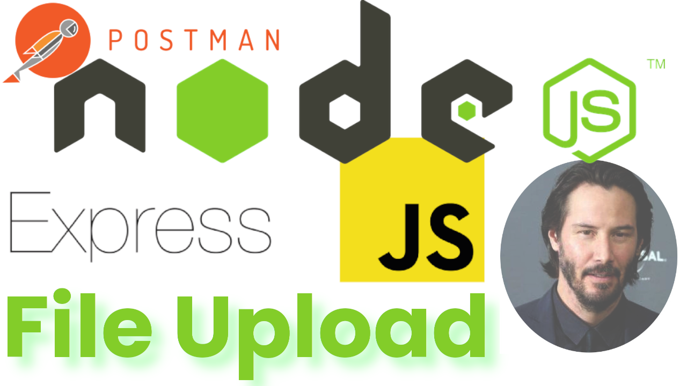

# <span style="color:magenta">NodeJS Express File Upload BP</span>


[](https://github.com/yilber/readme-boilerplate)
[](https://github.com/Yilber/readme-boilerplate/blob/master/LICENSE)


<!-- ## Background -->



> Super Easy and Fast JavaScript NodeJs File Uploader Boilerplate!

### 📚 STACK
- Javascript
- Node Js
- Express
- [Express-FileUpload](https://www.npmjs.com/package/express-fileupload)

## Installation

Basic File upload boilerplate.

```sh
$ git clonehttps://github.com/sitowebveloce/nodejs-qrcode-gen-app.git
$ cd nodejs...
npm i
npm run dev
go to http://localhost:3031/
```

## How to use

* Clone the repo.
* Run
* Install packages. Customize according to your needs.

## 🐛 Bugs

maybe...sure!


## License

2022 gd.

Usage is provided under the MIT License. See [LICENSE](https://github.com/Yilber/readme-boilerplate/blob/master/LICENSE) for the full details.
